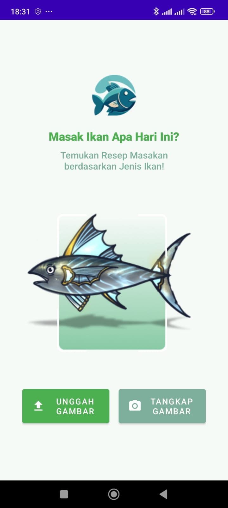
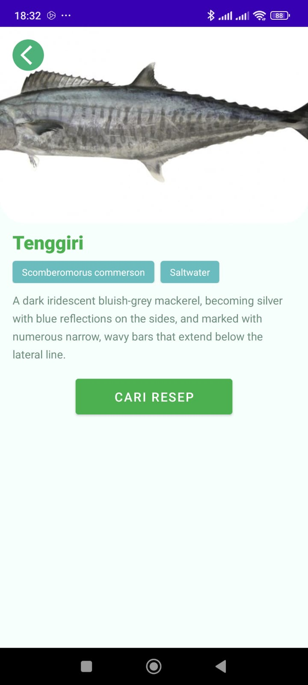
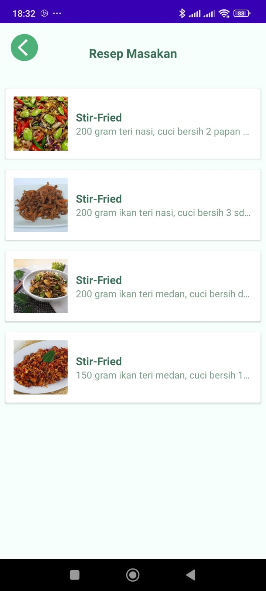

# Fish2Eat 

**Fish2Eat** is a mobile application designed to help users identify fish, provide nutritional information, and recommend recipes to encourage healthy eating habits based on fish consumption.

---

## Key Features 
- **Fish Identification**: Upload a fish image to identify its type.  
- **Fish Information**: View detailed  about the identified fish.  
- **Recipe Recommendations**: Discover healthy recipes based on the selected fish.

---

## Tools 🛠️
- **Figma**
- **Android studio**  
- **Kotlin** 
- **Retrofit**
- **Room**
- **glide**
- **Tensorflowlite**
- **Gson**

---

## Preview App

  
  
  
  
  

## How It Works 
1. **Fish Identification**:  
   Upload a fish photo or a photo of the fish, and the app will use machine learning to identify its type.  
2. **Get Fish Info**:  
   Access detailed fish data about the identified fish.  
3. **Explore Recipes**:  
   Find healthy recipes suitable for the fish you’ve identified.

---
